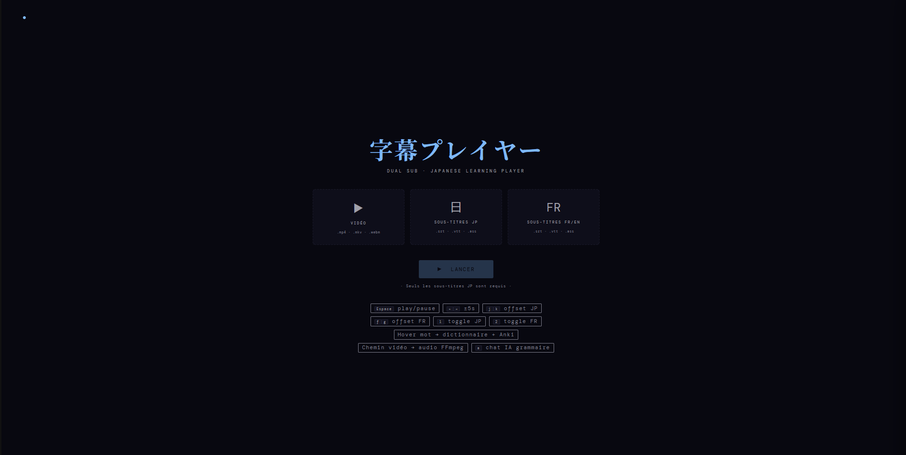
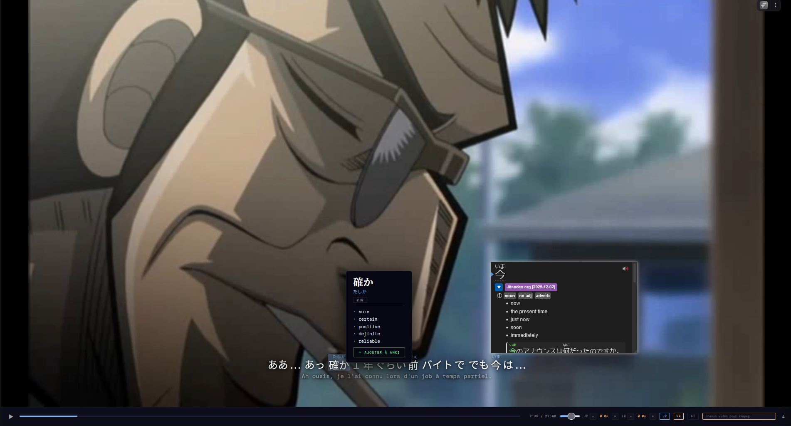
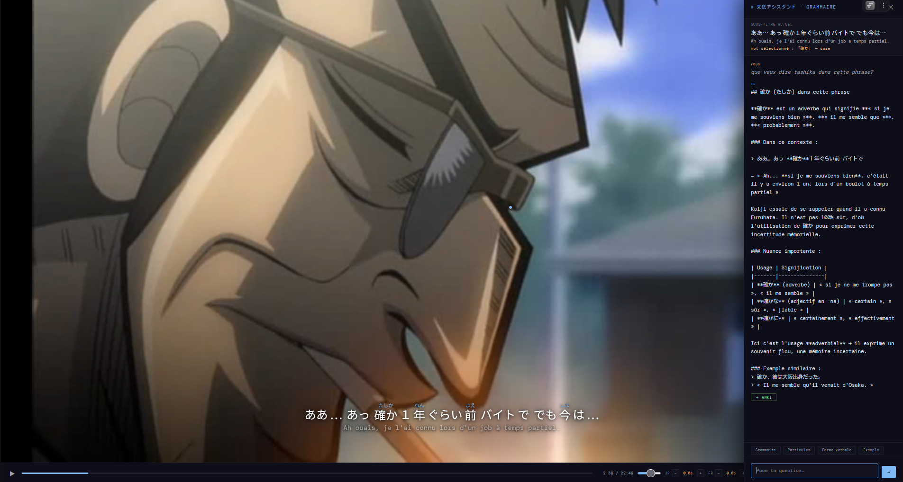

# Dual Jap Player

A small local web app + helper server for mining subtitles into Anki.

## Files

- `aniplayer.html` — main web UI (open in browser or served by the backend)
- `aniplayer.js` — frontend logic and controls
- `styles.css` — frontend styles
- `server.py` — lightweight backend: static file server plus API endpoints

## Requirements

- Python 3.8+
- FFmpeg available on `PATH` (for audio/screenshot extraction)
- Anki with the AnkiConnect plugin (for adding cards)
- Optional: `ANTHROPIC_API_KEY` environment variable for LLM chat features

## Quick start (serve locally)

1. Start the backend server:

```sh
python server.py
```

2. Open the player in your browser:

http://localhost:8766/aniplayer.html

## Notes

- `server.py` will print diagnostics on startup (FFmpeg found, Anki reachable, Anthropic key).
- The backend exposes helper endpoints used by the frontend (lookup, anki add, chat).
- If you prefer, you can open `aniplayer.html` directly from the filesystem, but some features (Anki/LLM/lookup proxy) require the backend.

## Screenshots

Title (homepage):



Dual (how it works):



AI chatbox:



## License

MIT — feel free to reuse and modify.
